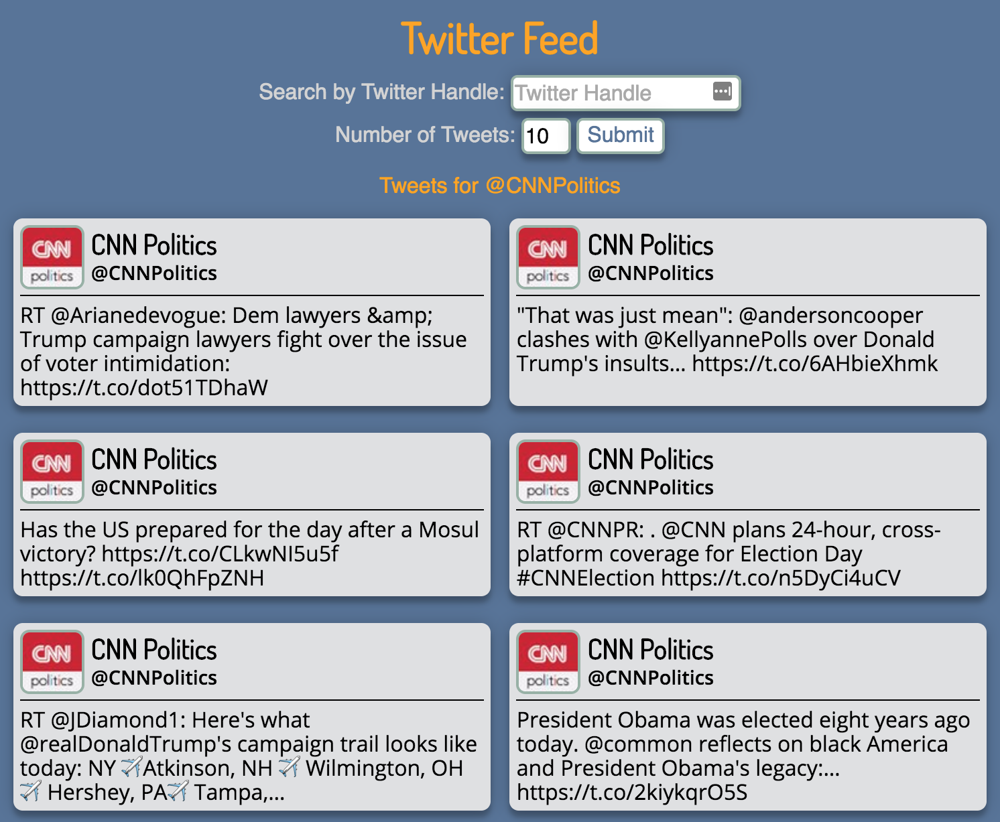

# Twitter Feed

## Overview

This node/express based application allows users to find a feed of any Twitter user's most recent tweets. I created this application in pursuit of a position as a Web Developer at Turner/CNN.

Deployed Product: [CNN Twitter Feed](https://cnn-twitter-feed.herokuapp.com/)
Trello Board: [CNN Twitter Feed](https://trello.com/b/nNStNPt8/cnn-twitter-feed)

## Finished Product:

[](https://cnn-twitter-feed.herokuapp.com/)

## Technologies Used

* **Languages:** HTML5, CSS3, JavaScript
* **CSS:** Flexbox for fluid, responsive layout
* **Node Packages:** Twitter (API client library)
* **Server-Side:** Express 4 and Node 6.9.1
* **Text Editor:** Sublime Text 3
* **Project Planning & User Stories:** Trello

## Features

* Users are initially presented with the most recent tweets from a default account (currently [@CNNPolitics](https://twitter.com/CNNPolitics)).
* Users can search by username to get the feed of that user's most recent tweets.
* Any errors (user doesn't exist, user has no tweets, etc.) are handled and presented to the user.
* Users can click the handle of the tweet's author to visit their profile on Twitter.

## Build Process

### Design Approach

I approached this project with a mobile-first mindset. I designed the layout and styles for a small screen, writing media queries for any desired changes on medium to large screens. This mobile-first approach had multiple benefits.

##### Design simplicty/approachability

Designing for a mobile device helped me to prioritize content, allowing for a simple, smooth experience. Designing with a desktop-first mindset creates the risk of having too much content to try and squeeze on to a small screen. Expanding and adding content as the viewport expands is a much smoother experience.

##### Performance/load times

This impact is minimal with a small application like this one, but a mobile-first approach has a positive impact on performance and load times on mobile devices, where it's more important to make wise use of computing power and load speed.

CSS first loads any default styling, then loading styles within applicable media queries. This means that with an application designed primarily for the desktop, but being viewed on a phone, all desktop styles are loaded, even if they'll be overridden by mobile styles within a media query. Those overridden styles were unnecessary for the browser to load, as they'll likely never be used/viewed on the mobile device.

It's much more efficient if a mobile device can load default styles, which are mobile-optimized, and simply ignore the styles in media queries that don't apply. This does mean that a larger device will load some potentially unused styles specific to the mobile layout, but the larger device likely has the computing power to spare.


### Production Challenges

#### Working with a new API

I've seen the Twitter API used before, but hadn't used it myself. Twitter has good documentation and there are numerous resources online, so I was able to figure things out, but there's always a learning curve with a new technology. I do think that if I had already had experience with the Twitter API I could have spent more time on refining the design and functionality of the application. I definitely feel confident using this API in future projects.

#### Twitter API Rate Limits

I started development with the Twitter Streaming API with the intention of developing an application to display a steady stream of tweets based on a hashtag or keyword. I was able to get tweets streaming in my terminal, but at one point when I tried to move forward I was met with a 420 error, indicating I had been disconnecting and reconnecting too frequently. Twitter doesn't publish the details of this, so I had no way of knowing how long it would be before I could connect again. Rather than let development stall, I decided to move to the Twitter REST API and develop an application that would give the user a Twitter user's feed of most recent tweets.


## Future Development

There are many things I would love to change, modify, or add to this project.

#### Additional Features
* Give the user more search parameters. Allow them to search by username, number of tweets, and keyword as well. The implementation of this may be limited by Twitter's API, but I think there's a good chance of finding a way to implement this feature.
* Add a pagination feature, putting every 'x' number of tweets on their own page and allowing users to go through those pages.
* Find a way to make links clickable within a tweet's text, whether to a user, hashtag, media, or an external page. Right now they're just text, but the tweet object does return a tweet's entities, which I'm sure can be used to accomplish this.

#### Future Enhancements
* Research using web-sockets to create a self-updating feed.
* Develop an Angular front-end for what could potentially be a much smoother user experience. Searches, especially with more search parameters, could be made much quicker.


## Installation

The easiest way to use the application is to visit the [deployed product](https://cnn-twitter-feed.herokuapp.com/). If you'd like to get it running on your machine, follow these steps.

##### Step 1. Clone this repository and install dependencies

Run the following commands in your terminal.

```bash
git clone https://github.com/jhdoak/twitter-feed.git
cd twitter-feed
npm install
touch twitter-keys.bash
```
--

##### Step 2. Create a Twitter application

You'll need to create your own Twitter application in order to get your own API keys.

Visit [apps.twitter.com](https://apps.twitter.com/) and log in or register if necessary.

Click 'Create New App'

You'll need to fill out the following fields:


`Name:` The name won't matter for our purposes, but it must be unique.
`Description:` Like the name, this doesn't have to be anything specific.
`Website:` This is important for applications that create tweets. This app doesn't provide that functionality, so any URL will do. (i.e. http://www.example.com)

--

##### Step 3. Retrieve API keys and store them in `twitter-keys.bash`

API keys are sensitive information, and shouldn't be shared publicly. We'll accomplish this by storing them in `twitter-keys.bash` and sourcing them in our application as environment variables.

In the information page for application in [apps.twitter.com](https://apps.twitter.com/), click the 'Keys and Access Tokens' tab. Find the 'Create my access token' button at the bottom of the page an click it to generate your access token.

You should now notice a 'Consumer Key', 'Consumer Secret', 'Access Token', and 'Access Token Secret'.

Open the `twitter-keys.bash` file in a text editor. Add the following lines of text, with the keys from your application between the quotes.

```
export TWITTER_CONSUMER_KEY=''
export TWITTER_CONSUMER_SECRET=''
export TWITTER_ACCESS_TOKEN_KEY=''
export TWITTER_ACCESS_TOKEN_SECRET=''
```

--

##### Step 4. Source API keys and start the server.

In the terminal, cd into the twitter-feed directory if you aren't already there. Run the following command to source your Twitter API keys.

```bash
source twitter-keys.bash
```
With the Twitter API keys sourced, we can start the server and get the application running. While still in the project directory, run the following command in the terminal.

```bash
npm start
```
With the server now running, open a browser and visit `localhost:3000`. The application should be running, and you should be able to use the search functionality.

--

##### Step 5. Installation Note

Your API keys will not be automatically sourced each time you open your terminal. If you kill the server and close your terminal, you'll have to repeate step 4 to get the application running again.


## About:

My name is Justin Doak, and I'm a web developer with a desire to push myself to learn, grow, and create great applications. Check out what I've been up to, and get in touch! I'd love to hear from you.

Website: [jhdoak.com](https://www.jhdoak.com)
GitHub: [jhdoak](https://github.com/jhdoak)
Email: [justin@jhdoak.com](mailto:justin@jhdoak.com)
Twitter: [@justin_doak](https://www.twitter.com/justin_doak)
